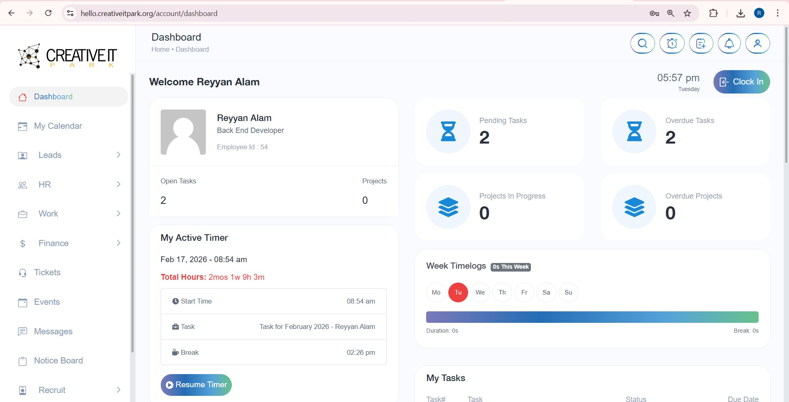
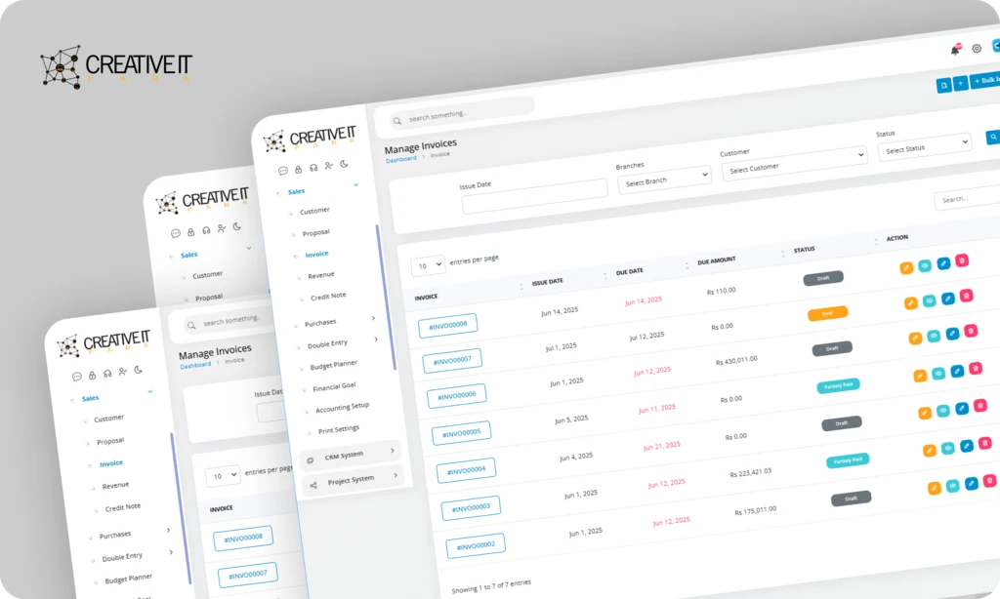

# Hello Creative IT Portal – Enterprise CRM / ERP

> **Production system built at Creative IT Park · Jan 2026 – Present**

The Hello Creative IT Portal is an all-in-one internal enterprise gateway that replaced three separate SaaS products — a CRM, a Project Management tool, and Accounting software — with a single unified platform. I engineered it from the ground up as the company's live operational backbone, handling everything from HR payroll to financial accounting in real time.

🔗 **Live platform:** [hello.creativeitpark.org](https://hello.creativeitpark.org)

---

## My Role

**Sole Backend Developer — architecture, development, server ops, and deployment**

I designed and built the full system: data architecture, business logic, double-entry accounting engine, HR automation, and project tracking — all deployed and maintained on production Linux servers.

---

## What It Does

- **Full HR Suite** — staff profiles, shift scheduling, leave management, attendance tracking with biometric sync, and fully automated payroll processing
- **Double-Entry Accounting Module** — complete ledger, P&L statement, balance sheet, cash flow, trial balance — used as the company's live financial system
- **Kanban Deal Pipelines** — CRM for managing client deals from lead to close
- **Gantt-Chart Project Tracking** — task assignment, progress tracking, milestone management
- **Client Invoicing** — auto-generated draft invoices triggered when project tickets move to "Completed"
- **B2B Financial Reporting** — real-time visibility into project profitability for the executive team

---

## 📸 Screenshots

<table>
  <tr>
    <td></td>
    <td></td>
  </tr>
</table>

---

## Key Problems I Solved

### 📒 Double-Entry Accounting Engine
The hardest part of the project. Built a strictly **atomic database transaction layer** ensuring every debit has a matching credit across the entire ecosystem — HR payroll, project costs, and client invoicing all balanced in real time. A single failed transaction rolls back completely — no partial writes, no corrupted ledger state.

### 🔄 Kanban-to-Invoice Automation
Engineered a seamless pipeline where moving a project ticket to "Completed" automatically generates a draft invoice for the client — eliminating manual billing steps and ensuring no completed work goes unbilled.

### ⏱️ Payroll Automation with Biometric Sync
Integrated staff attendance (from biometric data) directly into the payroll module to automate overtime calculations and leave-balance deductions — reducing payroll processing time from **3 days to under 15 minutes**.

### 🏗️ Replacing 3 SaaS Products with One System
Designed a unified data model that allows HR, project management, and accounting to share a single source of truth — so a project cost flows automatically into the P&L, and a payroll run reflects instantly in the cash flow statement.

---

## Results

- ✅ **Payroll processing cut from 3 days → under 15 minutes** via biometric sync + automation
- ✅ **100% executive visibility** into project profitability in real time
- ✅ Replaced 3 separate SaaS subscriptions with a single internal platform
- ✅ Atomic double-entry ledger — zero accounting discrepancies since launch
- ✅ Used daily as the company's live financial and operational system

---

## Tech Stack

| Layer | Technology |
|---|---|
| Framework | PHP · Laravel |
| Database | MySQL |
| Cache | Redis |
| Frontend | Vue.js · PHP Blade |
| Accounting | Custom Double-Entry Engine (Atomic Transactions) |
| Server | Linux · cPanel · Nginx |
| Deployment | Staging → Production · Zero-Downtime |

---

## Architecture Overview

```
Single Sign-On Portal
  │
  └── Laravel Core
        │
        ├── HR Suite ──────────── Biometric Sync → Payroll Automation
        │
        ├── CRM / Deal Pipelines ─ Kanban Board → Auto-Invoice on Completion
        │
        ├── Project Engine ─────── Gantt Charts · Task Assignment · Milestones
        │
        ├── Accounting Core ────── Double-Entry Ledger (Atomic Transactions)
        │     ├── P&L Statement
        │     ├── Balance Sheet
        │     ├── Cash Flow
        │     └── Trial Balance
        │
        ├── MySQL ── Redis Cache
        └── Linux / cPanel Production Server (≥99% Uptime)
```

---

## About This Repo

> The source code for the Hello Creative IT Portal is proprietary and owned by Creative IT Park. This repository documents my contribution, architecture decisions, and the engineering challenges solved — standard practice for professional portfolio showcases.

**Experience letter from Creative IT Park available on request.**

---

*Built by [Reyyan Alam](https://github.com/Reyyan31) · Backend Engineer · Node.js & APIs · Cloud & DevOps*
